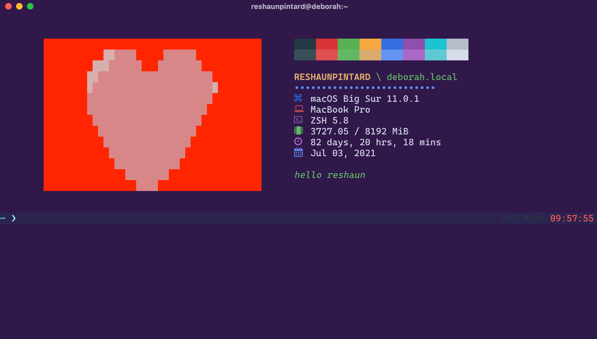

# **lewel**

lewel is a terminal diagnostic and welcome screen program written in python. So far it has support for macOS devices running python3 and macOS version 11.0.1 (2/20).



## **TABLE OF CONTENTS**

[I. Usage](#Usage)

1. [Getting Started](#GETTING-STARTED)
2. [Commands](#COMMANDS)

[II. Configurations](#Configurations)

1. [Images](#IMAGES)
2. [Display](#DISPLAY)
3. [Positioning](#POSITIONING)
4. [Date](#DATE)
5. [Uptime](#UPTIME)
6. [Memory & Performance](#MEMORY-AND-PERFORMANCE)
7. [Colors](#COLORS)

---

## Usage

### [**GETTING STARTED**](#TABLE-OF-CONTENTS)

The use of the program is simply to display a welcome screen so to get started is as simple as typing: `lewel init`. After answering the prompted questions to select your image or prexel, you can then type `lewel`.

To make sure lewel loads everytime your window is open you have to call it in your `.zshrc`, `.bashrc`, `.bash_profile` (which is typically found in your `$HOME` directory as a hidden file, or `/Users/user`), or whatever shell source file you're using. To do make this call automatically on each launch place the following at the very top of the aforementioned file:

**NOTE:** It's best practice to run the lewel program in your shell configuration file only after you've initialized
it for the very first time.

```zsh
export PATH="$PATH:$HOME/.lewel/bin"
lewel # run lewel
```

### [**COMMANDS**](#TABLE-OF-CONTENTS)

| **COMMAND SEQ**       | **DEFINITION**                                                      |
|-----------------------|---------------------------------------------------------------------|
| `$ lewel`             | will print the welcome screen to terminal                           |
| `$ lewel init`        | will init/reinitialize the program. useful for adding/changing pics |
| `$ lewel reset`       | will reset the program excluding configuration details              |
| `$ lewel config`      | will run the command line configuration wizard                      |
| `$ lewel config open` | will open configuration file in default text editor/application     |
| `$ lewel config vim`  | will open configuration file in vim text editor                     |
| `$ lewel help`        | will print this help message                                        |

---

## Configurations

This program is configurable to tailor your own message. Check `config.json` and make changes accoring to these valid options listed.

**IMPORTANT:** Deleting any of the `config.json` keys or values can result in breaking the program, so it is advised that users only make the suggested changes leaving keys untouched and perhaps nullifying corresponding values if the description of this manual says you're allowed to do so.

**NOTE:** Some configuration changes take place as soon as you make changes to the config.json file or the configuration
wizard. For changes not readily noticeable, it is advised that you run `lewel init` and simply press any key so the
program can recognize the latest changes to the configuration file.

If you find yourself in need of another `config.json` create a new file named "config.json" w the following content:

```json
{
    "welcome_message": "",
    "date_format": "full",
    "uptime_format": null,
    "memory_format": [
        "values",
        "MiB"
    ],
    "pf_result": "RAM",
    "should_display_image": true,
    "should_display_blocks": true,
    "should_display_text": true,
    "should_display_keys": true,
    "color_block_node": "    ",
    "space_before": 8,
    "space_after": 6,
    "lines_before": 2,
    "lines_after": 2,
    "hr_divider_node": "\u2219",
    "hr_node_repeat": 38,
    "default_bullet": "",
    "interface_bullet": "\ufb32  ",
    "machine_bullet": "\uf109  ",
    "shell_bullet": "\uf489  ",
    "cpu_bullet": "\ue266  ",
    "ram_bullet": "\ue266  ",
    "uptime_bullet": "\uf017  ",
    "date_bullet": "\uf073  ",
    "word_wrap": 30,
    "user_string_color": "light yellow",
    "machine_string_color": "light green",
    "hr_color": "light blue",
    "detail_key_color": "yellow",
    "detail_value_color": "light white",
    "text_description_color": "light green",
    "default_bullet_color": "red",
    "interface_bullet_color": "blue",
    "machine_bullet_color": "light red",
    "shell_bullet_color": "light magenta",
    "cpu_bullet_color": "yellow",
    "ram_bullet_color": "light green",
    "uptime_bullet_color": "light white",
    "date_bullet_color": "light blue",
    "interface_override": "",
    "machine_override": "",
    "shell_override": "",
    "cpuram_override": true,
    "uptime_override": true,
    "date_override": true
}
```

---

### [**IMAGES**](#TABLE-OF-CONTENTS)

Do you want to display a picture? `true` or `false`

```python
should_display_image = True

# OR

should_display_image = False
```

Insert the path to your display image in this variable.

```python
path_to_image = "sample.jpg"
```

The width and height of the picture in number of terminal cursor blocks. The suggested ratio is roughly 3:1 for width and height

```python
# Dimension ratio 40/14 = 2.86 ~> 3.0
# Appropriate for terminal welcome screen
width = 40
height = 14
```

---

### [**DISPLAY**](#TABLE-OF-CONTENTS)

Do you want to display the ANSI color blocks or the textual information? `true` or `false`

```python
# The size of the color block
color_block_size = 4
# xterm color theme in ANSI blocks
should_display_blocks = True
# All of the system information text
should_display_text = False
```

- You can add a brief welcome message to your lewel that won't print anything if the field is left empty. But it will print past the length of the provided image (if there is one), so it does have a limitless range.

- The amount by which you want to wrap your welcome message in number of approximate characters (to the nearest word)

```python
# Your custom message
welcome_message = "Welcome to your terminal"
# Word wrapping
word_wrap = 30
```

- You can set a divider between your username and your relevant data. The "node" for this divider can be any character. Common characters are '`-`', '`*`' and '`#`' the default choice for lewel is '`∙`' (U+2219). You can also choose how frequent you want this node repeated given an integer

- You can also set a preferred bullet point for all of the detail keys and in this configuration you can set whichever character and space combination you'd like within reason.

```python
# Choice of divider node ∙∙∙∙∙
hr_divider_node = "∙"
# Number of times to repeat
hr_node_repeat = 32
# Detail key bullet point
bullet = "- "
```

---

### [**POSITIONING**](#TABLE-OF-CONTENTS)

You can control where your pictures or text lies on the screen through the use of cursor spaces and carriage returns. These options take integer values

```python
# The space before picture or text
space_before = 6
# The space after picture
space_after = 8
# Number of lines before message
lines_before = 1
# Number of lines after message
lines_after = 1
```

This is helpful for combinations involving the choice of display for images, text and color blocks.

---

### [**DATE**](#TABLE-OF-CONTENTS)

You can add a date in any of the following formats `full`, `mmddyy`, or `daydd`.

```python
date_format = "daydd"
```

The options render the following outputs

| OPTION   | DISPLAY       |
|----------|---------------|
| `full`   | Jan 01, 2020  |
| `mmddyy` | 01/01/20      |
| `daydd`  | Wednesday 01  |

---

### [**UPTIME**](#TABLE-OF-CONTENTS)

You can add a computer **uptime** display in any of the following formats `days`, `hours`, or `colon`.

```python
uptime_format = "days"
```

The options render the following outputs

| OPTION  | DISPLAY                 |
|---------|-------------------------|
| `null`  | 40 days, 1 hrs, 12 mins |
| `days`  | 20 days, 20 hours       |
| `hours` | 300 hrs, 6 mins         |
| `colon` | 12:02:34                |

---

### [**MEMORY AND PERFORMANCE**](#TABLE-OF-CONTENTS)

You can either choose to display CPU performance of RAM performance as `CPU` or `RAM` using the performance result variable `pf_result` below

```python
pf_result = "CPU"
```

You can display this information using a format combination as described in the array below

```python
memory_format = ["values", "MiB"]
```

The options in the first index of the memory format array controls the template form of the display and the second index controls the unit value. The unit value can either be defined as Mebibyte `MiB` or Gigabyte `GB`. The template forms are either `percent`, `values` or `both`. There displays are as shown:

| OPTION 1  | OPTION 2     | DISPLAY              |
|-----------|--------------|----------------------|
| `percent` | `GB` / `MiB` | 24.81 %              |
| `values`  | `MiB`        | 2089.54 / 8192 MiB   |
| `both`    | `GB`         | 2.20 / 8 GB (27.49%) |

---

### [**COLORS**](#TABLE-OF-CONTENTS)

You can customize lewel with a preferred color for several of the detail text components. These colors are the templated 16-choice colors your terminal uses. To modify these specific colors, you will have to change the corresponding ANSI color in your terminal profile (located usually in the settings of your emulator).

The following color values are:

| **Normal** | **Light**     |
|------------|---------------|
|black       | light black   |
|red         | light red     |
|green       | light green   |
|yellow      | light yellow  |
|blue        | light blue    |
|magenta     | light magenta |
|cyan        | light cyan    |
|white       | light white   |

All of the color related mutable objects are as follows:

```python
# USER /
user_string_color: "red"
# / host
machine_string_color: "light red"
# ∙∙∙∙∙∙∙∙∙∙∙∙∙∙∙∙∙∙∙∙
hr_color: "cyan"
# OS, MACHINE, SHELL
detail_key_color: "blue"
# ZSH 5.X, [Date info]
detail_value_color: "light blue"
# Blah blah blah blah blah blah blah blah
text_description_color: "light green"
```
